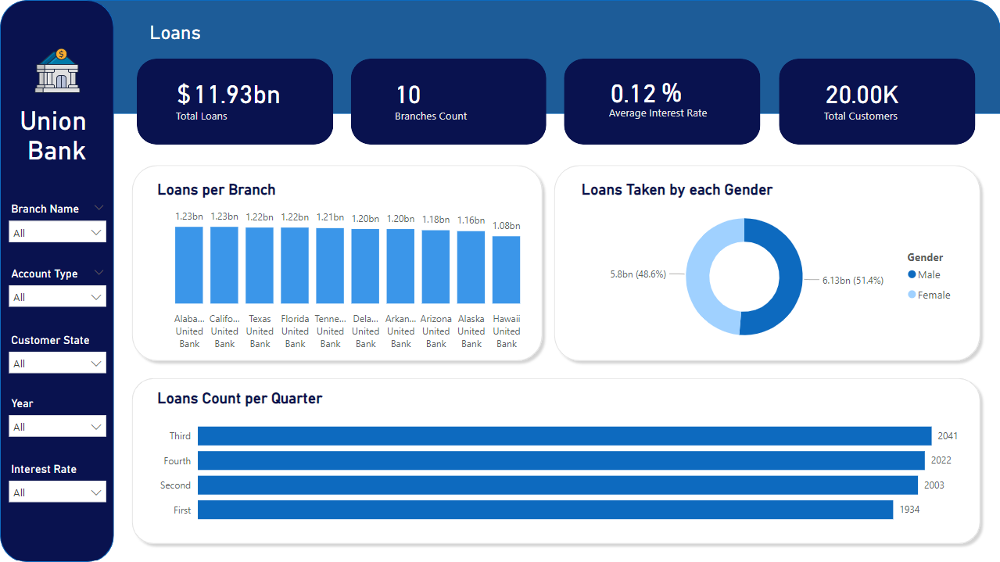
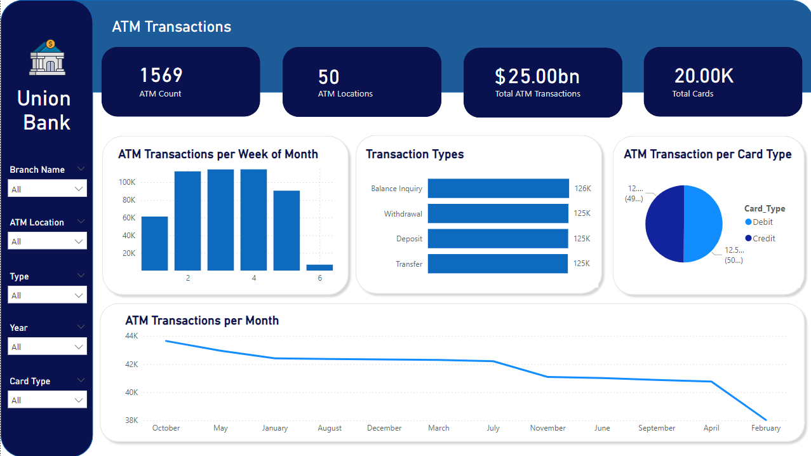

# Banking-DWH-system-ETL-SSIS

## Introduction

The goal of this project is to design a Data Warehouse for a bank to support Bi reporting and analytics.

## Architecture 

## OLTP Schema Diagram (source)

## OLAP Schema Diagram (destination) 
- We designed a galaxy schema, that serves our use case

## Mapping
- ATM_transactions_fact

- Loans_fact

- Account_Dim

- ATM_Dim

- Branch_Dim

- Card_Dim

- Customer_Dim

- Department_Dim

- Employee_Dim

## Insights
- Here are some insights we derived from our data

## Technology Used
- SQL
- SSMS
- SSIS
- SSAS
- Excel
- Power Bi

