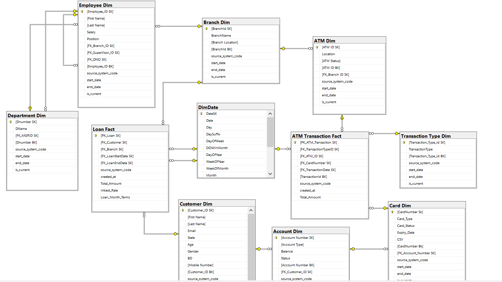

# Union-Bank-ETL

## Introduction

The goal of this project is to design a Data Warehouse for a bank to support Bi reporting and analytics.

## Architecture 

## Schema 
- We designed a galaxy schema, that serves our use case

## Insights
- Here are some insights we derived from our data

## Technology Used
- SQL
- SSMS
- SSIS
- SSAS
- Excel
- Power Bi

